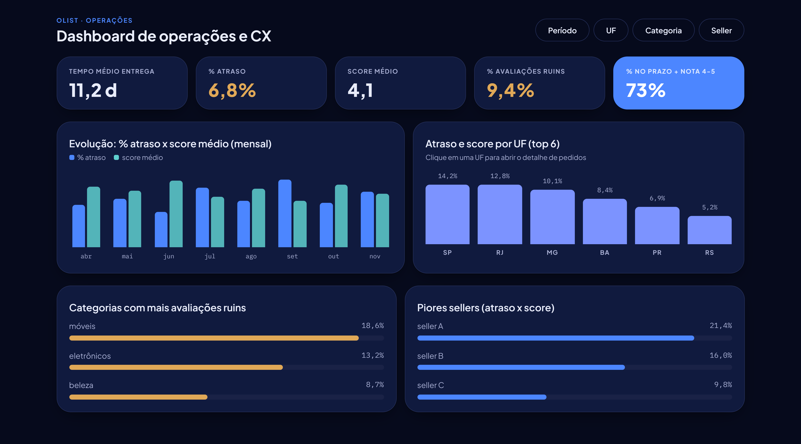
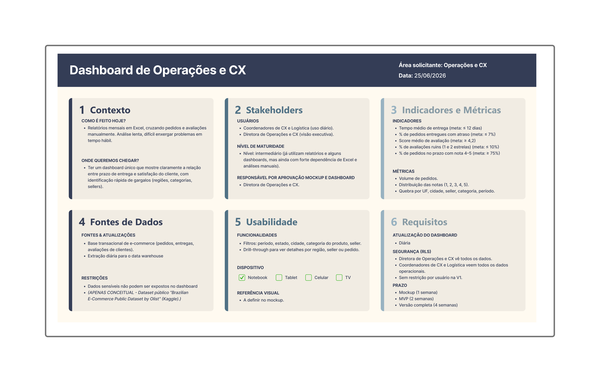
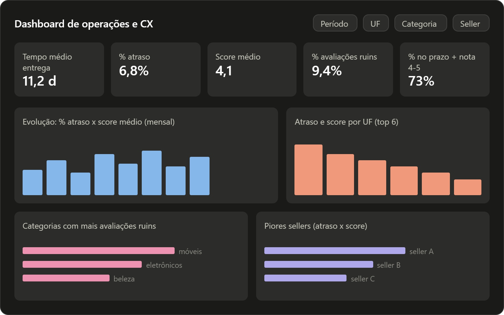
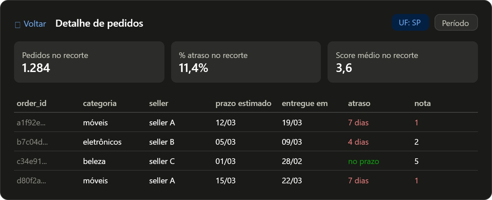

# Dashboard de Operações e CX

Um dashboard de Power BI que conecta **prazo de entrega** e **satisfação do cliente** na mesma tela, para responder uma pergunta que relatório de Excel não responde rápido: *onde a demora está custando nota?*

Construído do zero — do levantamento de requisitos aos oito visuais customizados desenvolvidos em TypeScript, porque nenhum visual nativo do Power BI entregava a identidade visual definida no mockup.

<!-- TROCAR pelo print do dashboard real quando disponível -->


> A imagem acima é o **mockup** aprovado antes da construção. O relatório final segue esse layout.

---

## O problema

A análise era feita em relatórios mensais de Excel, cruzando pedidos e avaliações à mão. Lenta, e tarde demais para agir: quando o gargalo aparecia, o mês já tinha fechado.

O objetivo foi ter **uma tela única** que mostrasse a relação entre atraso e nota, com identificação rápida de onde o problema está concentrado — região, categoria ou seller.

## Os indicadores

Cinco KPIs, cada um com meta definida pela área antes da construção:

| Indicador | Meta | Resultado no período |
|---|---|---|
| Tempo médio de entrega | ≤ 12 dias | 12,5 dias ✗ |
| % de pedidos entregues com atraso | ≤ 7% | 8,0% ✗ |
| Score médio de avaliação | ≥ 4,2 | 4,16 ✗ |
| % de avaliações ruins (1–2 estrelas) | ≤ 10% | 12,8% ✗ |
| % de pedidos no prazo com nota 4–5 | ≥ 75% | 76,2% ✓ |

Quatro dos cinco indicadores ficam fora da meta — e é exatamente esse o tipo de leitura que o dashboard existe para tornar imediata.

**Base analisada:** 95.824 pedidos entregues e avaliados, 109.362 itens, entre setembro de 2016 e agosto de 2018, cobrindo 74 categorias, 3.095 sellers e 27 UFs.

## O processo

O projeto seguiu a metodologia de [Gabriela Costa](https://www.linkedin.com/pulse/criando-dashboards-do-zero-gabriela-costa-yswwf/), da entrevista com o cliente à entrega:

**1. Entrevista** — simulada com IA sobre a documentação do dataset, para levantar dores, usuários e indicadores como aconteceria num projeto real.

**2. Canvas de Requisitos** — contexto, stakeholders, indicadores e metas, fontes, usabilidade e requisitos, tudo fechado antes de abrir o Power BI.



**3. Wireframes** — estrutura e hierarquia da informação, sem cor e sem estilo, para discutir o *que* mostrar antes de discutir *como*.

| Tela 1 — Visão geral | Tela 2 — Detalhe |
|---|---|
|  |  |

**4. Mockup** — identidade visual aplicada, aprovado antes de qualquer linha de código.

**5. Construção** — modelo dimensional, medidas DAX e os visuais customizados.

📄 **[Documentação completa do dashboard](<!-- LINK DA DOC -->)** — objetivo, fontes, transformações, modelo dimensional, medidas e controle de acesso.

## Os visuais customizados

O mockup definiu uma identidade que os visuais nativos não alcançam: cantos arredondados específicos, tipografia Plus Jakarta Sans, barras em formato de pill, tema claro/escuro alternável. Em vez de abrir mão do design, **oito visuais foram desenvolvidos do zero** com o Power BI Visuals SDK.

| Visual | Função |
|---|---|
| `tabelaOlist` | Tabela com busca, colunas congeladas, totais configuráveis e destaque de status em pill |
| `barrasOlist` | Barras e colunas com combo, eixo duplo, Top N, linha de referência e barras em pill |
| `cardsOlist` | Linha de cards de KPI, um por medida, com variantes de destaque |
| `filtroOlist` | Filtro em pill com busca e seleção múltipla, aplicando filtro real no relatório |
| `cabecalhoOlist` | Título com sobretítulo azul |
| `botaoVoltarOlist` | Link "voltar" com a identidade visual |
| `temaOlist` | Interruptor claro/escuro, sincronizável entre páginas |
| `fundoOlist` | Bloco de fundo que muda de cor com o tema |

Todos em **TypeScript**, com LESS para estilo, D3 onde há desenho vetorial, e Jest cobrindo a lógica pura. O tema claro/escuro é compartilhado entre todos por uma única medida DAX.

## Stack e modelagem

- **Power BI Desktop** (formato PBIP, versionável)
- **Power Query (M)** para a camada de transformação
- **DAX** — 9 medidas organizadas em pastas de exibição
- **TypeScript / LESS / D3 / Jest** nos visuais customizados
- **Modelo estrela com dois fatos em grãos diferentes**: `fatoPedidos` (grão de pedido) e `fatoItensPedido` (grão de item), com 4 dimensões e uma tabela desconectada para o tema

Duas decisões de modelagem que valem menção:

- **Anonimização na origem.** O `seller_id` real nunca chega ao relatório: a `dimVendedor` o substitui por "Vendedor N", atendendo à restrição de não expor dados sensíveis definida no Canvas.
- **Atributos trazidos ao grão do item.** `fatoItensPedido` carrega categoria, vendedor e datas via `RELATED`, evitando o cross-join que aparece ao cruzar tabelas de grãos diferentes em visuais sem medida.

## Como abrir

```bash
git clone https://github.com/deividgoulart/bi-project-olist.git
```

1. Abra `dashboard/portifolio.pbip` no Power BI Desktop.
2. Importe os oito `.pbiviz` em **Inserir → Mais visuais → Importar visual de um arquivo**.
3. Os CSVs estão em `data/`. As consultas do Power Query apontam para um caminho local — ajuste-o para a sua pasta, ou troque por `Web.Contents` apontando para este repositório, que é o que permite atualizar no Power BI Service sem gateway.

## Dados

[Brazilian E-Commerce Public Dataset by Olist](https://www.kaggle.com/datasets/olistbr/brazilian-ecommerce) — dados reais e anonimizados de ~100 mil pedidos feitos em marketplaces brasileiros entre 2016 e 2018.

Licença [CC BY-NC-SA 4.0](https://creativecommons.org/licenses/by-nc-sa/4.0/). Os arquivos em `data/` são cópia do dataset original, mantida aqui para que o relatório possa ser atualizado sem depender de arquivo local. O `olist_geolocation_dataset.csv` não foi incluído por não ser usado pelo modelo.

> O cenário de negócio — a área solicitante, os stakeholders e as metas — é **fictício**, construído para o exercício. Os dados são reais.
